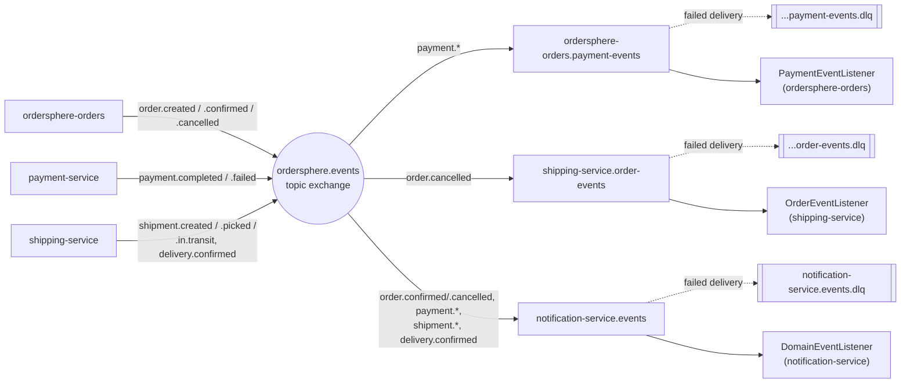

# OrderSphere — Technical Architecture

This document describes how OrderSphere is actually built today — architecture, service design, event messaging, data model, security, and the technology stack — verified against the codebase (Maven POMs, RabbitMQ config classes, service code, Flyway migrations) rather than restated from planning docs. See [product-functionality.md](./product-functionality.md) for the business-facing view.

**Version:** 1.0.0-SNAPSHOT | **Status:** Active development | **Verified against:** commit `fb04d21`

---

## 1. Overview

OrderSphere is a cloud-native order and inventory management platform built as ten Maven modules — eight independently deployable Spring Boot services plus two shared libraries. It exists to demonstrate — and exercise — the hard parts of distributed order processing: reserving stock without overselling, keeping payment and fulfillment eventually consistent, giving every state transition a compensating path back out, and — the part that's easy to get wrong — making sure the two independent things that can each try to finish the same step don't race each other into a lost update.

The system runs today as a full Docker Compose stack: a Eureka service registry, an API gateway, six business services, PostgreSQL (one schema per service), and RabbitMQ for asynchronous fan-out. Every service builds, has a Flyway-managed schema, and carries its own test suite.

---

## 2. Architecture

Two patterns coexist by design: synchronous orchestration for the order saga itself, and asynchronous fan-out for everything downstream of it.

### Orchestration, not pure choreography

The Orders service is the saga's orchestrator. When a customer places an order, `OrderService.createOrder` calls Inventory and Payment directly over load-balanced REST (Spring's `RestClient`, resolved through Eureka) and drives compensation inline — a failed reservation cancels the order immediately; a failed payment releases the reservation it just made. This is a deliberate departure from a fully event-choreographed design: REST gives the saga a synchronous, easy-to-reason-about failure path, while the event bus is reserved for everything that doesn't need to block the request.

### Resilience: circuit breakers on the saga's outbound calls

Each of Orders' three REST clients (`InventoryClient`, `PaymentClient`, `ShippingClient`) is wrapped in a Resilience4j circuit breaker, one instance per downstream service (`inventory-service`, `payment-service`, `shipping-service`), so a degraded dependency fails fast instead of piling up blocked saga threads. Fallback methods preserve the exact exception types the saga already expects — `InventoryReservationException`, `PaymentInitiationException`, `ShipmentCreationException`, `ShipmentLookupException` — whether the underlying call actually failed or the breaker is simply open, so `OrderService`'s compensation logic needed no changes. Best-effort calls (`InventoryClient.release`, `PaymentClient.refund`) keep failing silently under an open breaker, matching their existing behavior. Breaker state (open/closed/half-open, failure rate) is exposed via Spring Boot Actuator at `/actuator/circuitbreakers` and `/actuator/circuitbreakerevents`. The shared `RestClient.Builder` (`RestClientConfig`) carries a connect timeout of `ORDERS_REST_CLIENT_CONNECT_TIMEOUT_MS` (default 2s) and a read timeout of `ORDERS_REST_CLIENT_READ_TIMEOUT_MS` (default 5s) — comfortably under every breaker's `wait-duration-in-open-state` (15–20s) — so a hung downstream call fails fast enough to actually register as a breaker failure instead of blocking a saga thread indefinitely.

### Concurrency: serializing the saga's competing paths

Orders confirms a payment two independent ways — a `PaymentEventListener` reacting to `PaymentCompletedEvent`/`PaymentFailedEvent` off the broker, and `OrderSagaProgressJob`'s polling sweep, which exists precisely so a dropped event doesn't strand an order forever. Both paths can see the same order as `AWAITING_PAYMENT` at once, so both now take a `SELECT ... FOR UPDATE` row lock (`OrderRepository.findByIdForUpdate`) before checking or mutating status: whichever gets there first wins, and the loser re-reads the now-`CONFIRMED`/`CANCELLED` order and no-ops instead of double-confirming it. `OrderService.cancelOrder` takes the same lock, so a customer cancelling right as the saga confirms can't race it either.

A row lock only works once a row exists, so it can't protect Shipping's own create-shipment endpoint — the first call for a given order has nothing to lock yet. There, the `shipments` table's `uq_shipments_order_id_type` unique constraint is the actual serialization point: two concurrent creates can both pass the check-then-insert, but the loser's insert fails the constraint, and `ShipmentService` catches that and falls back to fetching the winner's row instead of surfacing a 500.

### Events as the async layer

Every state change Orders, Payment, or Shipping makes is also published locally as a Spring `ApplicationEvent` and relayed onto a RabbitMQ topic exchange by a shared `DomainEventRelay`. Three things consume off that bus today: Notification service, which reacts to order, payment, and shipment events to trigger customer messages; Orders itself, listening for `PaymentCompletedEvent`/`PaymentFailedEvent` as a low-latency shortcut around its own polling sweep job; and Shipping, which halts an in-flight shipment when it hears `OrderCancelledEvent`. Inventory and Payment are not yet wired as message consumers — every service publishes into the same exchange (see §4), but only 6 of the 19 event types anyone publishes actually have a bound queue reading them.

### Request topology

All external traffic enters through the gateway; every service resolves its peers (and is resolved by the gateway) via Eureka, and owns an isolated Postgres schema. Orders is the only service that calls the other three directly.

---

## 3. Service catalog

Eight runtime services plus two shared libraries. Ports match the Docker Compose configuration and are stable across local and containerized runs.

| Service | Port | Responsibility | Database |
|---|---|---|---|
| `ordersphere-gateway` | 8080 | Single external entry point; routes to services via Eureka discovery locator | — |
| `auth-service` | 8081 | Registration, login, JWT issuance, role assignment (admin-only) | `auth_db` |
| `ordersphere-orders` | 8082 | Order lifecycle and saga orchestration — calls inventory, payment, shipping | `orders_db` |
| `inventory-service` | 8083 | Product catalog, stock levels, reservation and release | `inventory_db` |
| `payment-service` | 8084 | Payment methods, async payment processing, refunds | `payment_db` |
| `shipping-service` | 8085 | Shipment creation, tracking-stage progression, returns | `shipping_db` |
| `notification-service` | 8086 | Multi-channel notification delivery, per-channel preferences, retry | `notification_db` |
| `service-registry` | 8761 | Eureka server — service discovery for every service above | — |
| `common-events` | — | Shared library: event POJOs, topic-exchange auto-configuration, routing-key derivation, dead-letter relay | — |
| `common-security` | — | Shared library: JWT issuance/validation, Spring Security filter, role model | — |

---

## 4. Event messaging

All async traffic moves through a single RabbitMQ topic exchange, `ordersphere.events`, declared once by `common-events`' auto-configuration and shared by every service on the classpath.

### Routing

Each of the 19 event types defined in `common-events` (`OrderCreatedEvent`, `PaymentCompletedEvent`, `ShipmentCreatedEvent`, and so on) is published under a routing key mechanically derived from its class name — `RoutingKeys.forEventType` turns `PaymentCompletedEvent` into `payment.completed`. A `DomainEventRelay` subscribes to every locally-published `BaseEvent` and forwards it to the exchange, so publishing a new event type never requires touching messaging wiring — publishing always succeeds. Binding a queue to actually read it is a separate, deliberate choice, and most event types don't have one yet (see below).

### Consumers

Three durable queues exist today, each with its own dead-letter exchange and queue for redelivery failures:

| Queue | Owner | Bound routing keys |
|---|---|---|
| `ordersphere-orders.payment-events` | `ordersphere-orders` | `payment.completed`, `payment.failed` |
| `shipping-service.order-events` | `shipping-service` | `order.cancelled` |
| `notification-service.events` | `notification-service` | `order.confirmed`, `order.cancelled`, `payment.completed`, `payment.failed`, `shipment.created`, `shipment.picked`, `shipment.in.transit`, `delivery.confirmed` |

That's 8 of the 19 published event types actually reaching a consumer. The other 11 — everything auth-service and inventory-service publish, plus `PaymentInitiatedEvent`, `RefundIssuedEvent`, `NotificationSentEvent`, `NotificationFailedEvent` — currently reach the exchange and go nowhere; there's no bound queue to route them to.

Every shipment milestone binding to notification is recent: shipping-service's schema had no customer identity to address a notification with, so these were deliberately left unbound. The fix was a denormalized `customer_username` column on `shipments` (`V2__add_shipment_customer_username`, populated once at shipment-creation time from the order) — event-carried state transfer, not a foreign key, so `DomainEventListener` can read it straight off the event payload the same way it already does for every other bound event, with no synchronous lookup back into another service.

Orders drives the saga synchronously (see §2) and publishes lifecycle events as a byproduct; three consumers exist on the broker today, each with a dead-letter queue for redelivery failures.

> **Why both patterns exist:** REST orchestration keeps the order-placement request's success/failure path synchronous and easy to test. The event bus exists for consumers that shouldn't be on that critical path — notifications, a faster-than-polling signal back to Orders, and Shipping reacting to a cancellation it wasn't otherwise told about. Inventory and Payment don't participate as consumers yet; they're purely REST call targets from Orders' side.

---

## 5. Data & persistence

Database-per-service, no cross-service foreign keys. Every service ships its own Flyway migration history against a single PostgreSQL 16 instance (separate logical databases, seeded via `docker/postgres-init`).

| Service | Migrations |
|---|---|
| `auth-service` | `V1__create_users_table` |
| `ordersphere-orders` | `V1__create_orders_tables`, `V2__add_payment_and_shipment_tracking_to_orders` |
| `inventory-service` | `V1__create_inventory_tables` |
| `payment-service` | `V1__create_payment_tables` |
| `shipping-service` | `V1__create_shipping_tables`, `V2__add_shipment_customer_username` |
| `notification-service` | `V1__create_notification_tables` |

Orders' second migration is a small but telling design signal: rather than joining out to Inventory or Payment for status, Orders keeps its own denormalized `paymentId`/`shipmentId` tracking columns — consistent with treating those services as call targets, not sources of truth Orders queries live. Shipping's second migration is the one deliberate exception to "no cross-service data" in this codebase: a `customer_username` column copied from the order at shipment-creation time, purely so shipment events can address a notification (see §2, §4) — not a foreign key, and not queried back against Orders.

---

## 6. Security

Authentication is centralized in `auth-service`; enforcement is distributed via the shared `common-security` library.

- **JWT, 1-hour expiry** — `JwtProperties.expirationMillis` defaults to 3,600,000ms; tokens are signed with a secret injected via `JWT_SECRET` (falls back to a clearly-marked dev-only default in Compose).
- **Four roles** — `CUSTOMER`, `VENDOR`, `ADMIN`, `AUDITOR`, defined once in `auth-service`'s domain model and carried in the token's claims for downstream services to authorize against.
- **Password storage** — bcrypt via Spring Security's `PasswordEncoder`.
- **Service-to-service calls** — Orders' outbound REST calls to Inventory/Payment/Shipping forward the caller's bearer token; a `ServiceTokenProvider` issues a service-level token for calls the scheduled saga sweep makes without an inbound request context.

---

## 7. Technology stack

What every service is actually built on, confirmed against each module's `pom.xml`.

| Technology | Role |
|---|---|
| Java 17 | Language baseline, parent POM |
| Spring Boot 3.2.1 | Service framework across all ten modules |
| Spring Cloud Gateway | API gateway routing |
| Netflix Eureka | Service discovery, client + server |
| Spring Cloud LoadBalancer | Client-side balancing for Orders' outbound calls |
| Resilience4j (Spring Cloud Circuit Breaker) | Per-dependency circuit breakers on Orders' inventory/payment/shipping clients |
| Spring Boot Actuator | `health`, `circuitbreakers`, `circuitbreakerevents` endpoints (Orders only, currently) |
| Spring Data JPA | Persistence layer, every business service |
| PostgreSQL 16 | System of record, one schema per service |
| Flyway | Schema migrations |
| Spring AMQP / RabbitMQ 3.13 | Topic-exchange event fan-out |
| Spring Security | Auth filter chain, method-level authorization |
| jjwt | JWT issuance and validation |
| Jackson + jsr310 | Event (de)serialization, incl. `java.time` types |
| Lombok | Boilerplate reduction across domain/DTO classes |
| JUnit 5 + Testcontainers | Unit and integration tests against real Postgres/RabbitMQ |
| Docker + Docker Compose | Local multi-service environment, per-service Dockerfiles |
| Maven (multi-module) | Build & dependency management, shared parent POM |

> **Documented but not yet present in the tree:** Kubernetes manifests and Hyperledger Fabric are described in the project's architecture notes as target infrastructure. Neither has build artifacts in this repository yet — see §10.

---

## 8. Build & deployment

The working deployment path today is Docker Compose; Kubernetes is documented as the target but has no manifests in-repo yet.

- `mvn clean package` builds all ten modules from the root parent POM.
- Each of the eight runtime services has its own `Dockerfile`; `docker-compose.yml` builds and wires all eight plus `postgres` and `rabbitmq`, in dependency order (registry and brokers first, business services depend on both).
- Configuration is environment-variable driven throughout — `DB_HOST`, `EUREKA_URI`, `RABBITMQ_HOST`, `JWT_SECRET` — the same images run locally or in a cluster without rebuilding.
- A single service can be run standalone with `mvn spring-boot:run` provided Postgres and Eureka are reachable.

---

## 9. Testing

Every module carries its own test suite; `common-events` is the most heavily covered, with one test class per event type plus the routing/relay logic.

| Module | Test classes |
|---|---|
| `common-events` | 22 |
| `ordersphere-orders` | 10 |
| `notification-service` | 6 |
| `inventory-service` | 5 |
| `payment-service` | 5 |
| `shipping-service` | 5 |
| `auth-service` | 3 |
| `common-security` | 2 |
| `ordersphere-gateway` | 1 |
| `service-registry` | 1 |

Integration coverage runs against real dependencies via Testcontainers (Postgres and RabbitMQ), rather than mocking the database or broker — the suites in `ordersphere-orders` and `common-events` in particular exercise actual message publish/consume round-trips. Every `@SpringBootTest`-based integration test class carries `@DirtiesContext(classMode = AFTER_CLASS)`: without it, Testcontainers tears down the Postgres/RabbitMQ containers right after the test class finishes, but the cached Spring context (and its live `@Scheduled` jobs and AMQP listeners) can outlive them until the JVM exits — the mismatch shows up as retry-spam against dead containers and, eventually, Surefire force-killing the fork after a 30s hang.

---

## 10. Roadmap

What's shipped versus what's still ahead, per the project's own tracked roadmap.

- [x] Message broker (RabbitMQ) wired for cross-service async events
- [x] Circuit breakers (Resilience4j) around Orders' outbound REST calls
- [ ] React/Vue.js web UI
- [ ] Comprehensive API documentation (OpenAPI/Swagger)
- [ ] Hyperledger Fabric ledger service for immutable audit trails
- [ ] CQRS-based analytics/reporting
- [ ] Distributed tracing (Jaeger/Zipkin)
- [ ] Centralized logging (ELK stack)
- [ ] Caching layer (Redis)
- [ ] OAuth2/OIDC, Kubernetes manifests
