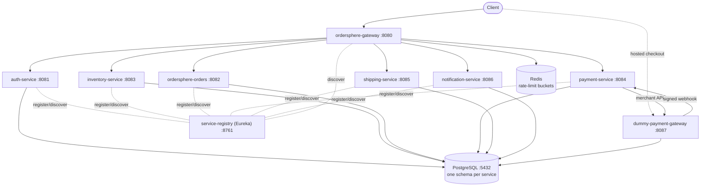
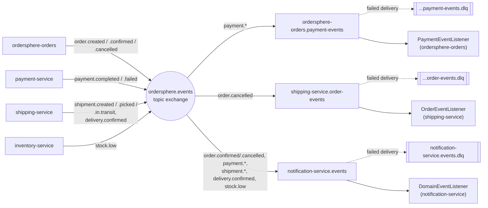

# OrderSphere — Technical Architecture

This document describes how OrderSphere is actually built today — architecture, service design, event messaging, data model, security, and the technology stack — verified against the codebase (Maven POMs, RabbitMQ config classes, service code, Flyway migrations) rather than restated from planning docs. See [product-functionality.md](./product-functionality.md) for the business-facing view.

**Version:** 1.0.0-SNAPSHOT | **Status:** Active development | **Verified against:** commit `2bc92bd`

---

## 1. Overview

OrderSphere is a cloud-native order and inventory management platform built as twelve Maven modules — nine independently deployable Spring Boot applications (eight platform services plus a stand-in payment provider) and three shared libraries. It exists to demonstrate — and exercise — the hard parts of distributed order processing: reserving stock without overselling, keeping payment and fulfillment eventually consistent, giving every state transition a compensating path back out, and — the part that's easy to get wrong — making sure the two independent things that can each try to finish the same step don't race each other into a lost update.

The system runs as a full Docker Compose stack or on Kubernetes (Kustomize manifests in `k8s/`): a Eureka service registry, an API gateway, six business services, a dummy hosted-checkout payment provider, PostgreSQL (one database per service), RabbitMQ for asynchronous fan-out, Redis for gateway rate limits, Jaeger for distributed traces, and Loki, Alloy and Grafana for centralized logs. Every service builds, has a Flyway-managed schema and carries its own test suite; the six business services publish OpenAPI specs.

---

## 2. Architecture

Two patterns coexist by design: synchronous orchestration for the order saga itself, and asynchronous fan-out for everything downstream of it.

### Orchestration, not pure choreography

The Orders service is the saga's orchestrator. When a customer places an order, `OrderService.createOrder` calls Inventory and Payment directly over load-balanced REST (Spring's `RestClient`, resolved through Eureka) and drives compensation inline — a failed reservation cancels the order immediately (Inventory reserves all lines or none, and answers 409 with e.g. "Not enough stock: SKU-1 (2 requested, 0 available)" when any line is short - Orders keeps that text as the order's `cancellation_reason`); a failed payment releases the reservation it just made. The order's amount is never taken from the client: Inventory's reserve response prices every reserved line with the product's current `unit_price`, and Orders multiplies these out into `orders.total_amount` (also stamping `order_items.unit_price`) before passing that total to Payment. If any line comes back unpriced, the reservation is released and the order is cancelled without being charged. This is a deliberate departure from a fully event-choreographed design: REST gives the saga a synchronous, easy-to-reason-about failure path, while the event bus is reserved for everything that doesn't need to block the request.

### Resilience: circuit breakers on the saga's outbound calls

Each of Orders' three REST clients (`InventoryClient`, `PaymentClient`, `ShippingClient`) is wrapped in a Resilience4j circuit breaker, one instance per downstream service (`inventory-service`, `payment-service`, `shipping-service`), so a degraded dependency fails fast instead of piling up blocked saga threads. Fallback methods preserve the exact exception types the saga already expects — `InventoryReservationException`, `PaymentInitiationException`, `ShipmentCreationException`, `ShipmentLookupException` — whether the underlying call actually failed or the breaker is simply open, so `OrderService`'s compensation logic needed no changes. Compensation calls (`InventoryClient.release`, `PaymentClient.refund`) don't fail silently: under an open breaker they throw a retryable `CompensationCallException`, and the compensation outbox (below) tries again later. Breaker state (open/closed/half-open, failure rate) is exposed via Spring Boot Actuator at `/actuator/circuitbreakers` and `/actuator/circuitbreakerevents` (ADMIN only). A downstream 4xx is not counted as a breaker failure (`DownstreamClientErrorPredicate`) - only 5xx, 408, 429 and connection failures are. The shared `RestClient.Builder` (`RestClientConfig`) carries a connect timeout of `ORDERS_REST_CLIENT_CONNECT_TIMEOUT_MS` (default 2s) and a read timeout of `ORDERS_REST_CLIENT_READ_TIMEOUT_MS` (default 5s) — comfortably under every breaker's `wait-duration-in-open-state` (15–20s) — so a hung downstream call fails fast enough to actually register as a breaker failure instead of blocking a saga thread indefinitely.

### Reliable compensation: an outbox for refunds and stock releases

Refunds and inventory releases are never fire-and-forget (a lost call would let a cancelled order keep the customer's money). `OrderService` records each one as a row in `order_compensations`, in the same transaction as the order change that requires it - the cancellation and the obligation to refund commit together or not at all. `CompensationService` attempts the row right after commit (so the usual case is as fast as before) and the saga sweep retries anything still pending with exponential back-off (5s doubling up to 10 minutes, 20 attempts). A row is claimed with `SELECT ... FOR UPDATE SKIP LOCKED`, so the post-commit attempt and the sweep never process it twice at once. Retryable failures are outages, timeouts, throttling and 401/403 (e.g. a JWKS that couldn't be fetched yet); a request the other service rejects outright, or a row that runs out of attempts, is marked FAILED and logged for a person to look at. Both remote operations are idempotent (a repeated refund or release returns the existing result), so a retry after an ambiguous failure can't refund twice. A release that finds no reservation (404) counts as done. Admins see and re-queue FAILED rows through `/orders/admin/compensations` (and the Web UI's Admin page).

### Reliable fulfilment: retrying shipment creation

Shipment creation follows the same pattern. Once a payment completes the order is CONFIRMED - it's paid - even if Shipping is down; `OrderShipmentService` records the pending shipment on the order (`shipment_*` columns) and the saga sweep retries with the same back-off until Shipping accepts, rejects it (4xx) or 20 attempts run out. Shipping returns the existing shipment for a repeated request (the `uq_shipments_order_id_type` constraint, below), so a retry can't ship twice. Paid orders still without a shipment are listed for an admin at `/orders/admin/unshipped`, with a retry that grants a fresh budget.

### Concurrency: serializing the saga's competing paths

Orders confirms a payment two independent ways — a `PaymentEventListener` reacting to `PaymentCompletedEvent`/`PaymentFailedEvent` off the broker, and `OrderSagaProgressJob`'s polling sweep, which exists precisely so a dropped event doesn't strand an order forever. Both paths can see the same order as `AWAITING_PAYMENT` at once, so both now take a `SELECT ... FOR UPDATE` row lock (`OrderRepository.findByIdForUpdate`) before checking or mutating status: whichever gets there first wins, and the loser re-reads the now-`CONFIRMED`/`CANCELLED` order and no-ops instead of double-confirming it. `OrderService.cancelOrder` takes the same lock, so a customer cancelling right as the saga confirms can't race it either.

A row lock only works once a row exists, so it can't protect Shipping's own create-shipment endpoint — the first call for a given order has nothing to lock yet. There, the `shipments` table's `uq_shipments_order_id_type` unique constraint is the actual serialization point: two concurrent creates can both pass the check-then-insert, but the loser's insert fails the constraint, and `ShipmentService` catches that and falls back to fetching the winner's row instead of surfacing a 500.

### Payments: hosted checkout with an external provider

Payment is collected the way a real card provider (e.g. Stripe Checkout) does it, with `dummy-payment-gateway` standing in for the provider. `payment-service` never sees card details:

1. When Orders initiates a payment, `payment-service` opens a checkout session through `PaymentGatewayClient` (merchant API, secret-key auth) and returns its `checkoutUrl`. The order stays `AWAITING_PAYMENT` and the Web UI redirects the browser to that URL.
2. The customer pays (or cancels) on the provider's page. A declined card is shown on the page and can be retried; only success, cancellation or expiry ends the session.
3. The provider notifies `POST /payments/webhooks/gateway`. The endpoint has no JWT; instead the raw body must carry a valid HMAC-SHA256 signature (`X-Dummy-Gateway-Signature`) made with the shared webhook secret. The provider then redirects the browser back to the Web UI (`?payment=success|cancelled&orderId=N`), which polls the order until it settles.
4. Webhooks are best-effort, so `PaymentProcessingJob` also polls the provider for every PENDING payment. That catches lost webhooks and expired sessions (10 minutes, deliberately shorter than Inventory's 15-minute reservation hold). The webhook and the sweep take the same row lock, and only a PENDING payment is updated, so an outcome is applied once.
5. From there the saga is unchanged: `PaymentCompletedEvent` confirms the reservation and creates the shipment; `PaymentFailedEvent` releases stock and cancels. One new case: a successful payment for an order that was already cancelled (the customer paid on a page that was still open) is refunded automatically.

The dummy provider behaves like a real one in the ways that matter: it keeps sessions, charges and refunds in its own `gateway_db` (so they survive a restart), sends webhooks in the background with short timeouts (2s connect / 5s read - a slow merchant never holds up the customer's "Pay"), and publishes a settlement report (`GET /api/reports/transactions?from&to`).

**Reconciliation.** The sweep only settles PENDING payments; nothing else would notice settled records drifting from the provider's. `ReconciliationService` (daily at 02:00, or on demand by an admin) compares the provider's settlement report with payment-service's records and keeps a finding for each mismatch: `CHARGED_NOT_RECORDED`, `RECORDED_NOT_CHARGED`, `AMOUNT_MISMATCH`, `REFUND_NOT_RECORDED`, `REFUND_NOT_EXECUTED`, `UNKNOWN_SESSION`. Payments near the window's edge are confirmed by looking up their session, and young PENDING payments are left to the sweep. Nothing about money changes automatically: an admin *re-syncs* a finding (the provider's state is applied through the normal paths, so the order saga confirms or refunds as usual) or *resolves* it with a note; findings that later agree are closed as CLEARED, and a mismatch closed with a note isn't raised again. Runs and findings live in `reconciliation_runs` / `reconciliation_findings`.

Swapping in a real provider means replacing `DummyPaymentGatewayClient` (including its settlement-report call) and the webhook's signature check; the rest of the flow stays the same.

### Events as the async layer

Every state change Orders, Payment, or Shipping makes is also published locally as a Spring `ApplicationEvent` and relayed onto a RabbitMQ topic exchange by a shared `DomainEventRelay`. Three things consume off that bus today: Notification service, which reacts to order, payment, and shipment events to trigger customer messages; Orders itself, listening for `PaymentCompletedEvent`/`PaymentFailedEvent` as a low-latency shortcut around its own polling sweep job; and Shipping, which halts an in-flight shipment when it hears `OrderCancelledEvent`. Inventory and Payment are not message consumers — every service publishes into the same exchange (see §4), but only 9 of the 18 event types have a bound queue reading them.

### Request topology

All API traffic enters through the gateway; every service resolves its peers (and is resolved by the gateway) via Eureka, and owns an isolated Postgres database. Orders is the only service that calls the other three directly. The browser talks to the payment provider directly for the checkout page; the provider is not behind the gateway or in Eureka, as an external provider wouldn't be. Every service exports traces to Jaeger (not drawn).

---

## 3. Service catalog

Nine runtime applications plus three shared libraries. Ports match the Docker Compose configuration and are stable across local and containerized runs.

| Service | Port | Responsibility | Database |
|---|---|---|---|
| `ordersphere-gateway` | 8080 | Single external entry point; routes via Eureka discovery locator, Redis rate limits, CORS, one Swagger UI for every service | — (Redis) |
| `auth-service` | 8081 | Registration, login, the only JWT signer (RS256 + JWKS), refresh tokens, client credentials for services, role assignment (admin-only) | `auth_db` |
| `ordersphere-orders` | 8082 | Order lifecycle and saga orchestration — calls inventory, payment, shipping; compensation outbox, shipment retry, admin endpoints | `orders_db` |
| `inventory-service` | 8083 | Product catalog with prices and owners, stock levels, all-or-nothing reservation, restock, low-stock events | `inventory_db` |
| `payment-service` | 8084 | Hosted-checkout payments (checkout sessions, signed provider webhooks, reconciliation), refunds | `payment_db` |
| `shipping-service` | 8085 | Shipment creation, tracking-stage progression, returns | `shipping_db` |
| `notification-service` | 8086 | Multi-channel notification delivery, per-channel preferences, retry | `notification_db` |
| `service-registry` | 8761 | Eureka server — service discovery for every service above | — |
| `dummy-payment-gateway` | 8087 | Stand-in external payment provider: hosted checkout page, merchant API, settlement report, HMAC-signed webhooks. Not in Eureka, not behind the gateway | `gateway_db` |
| `common-events` | — | Shared library: event POJOs, topic-exchange auto-configuration, routing-key derivation, domain-event relay, RabbitMQ and `@Scheduled` tracing | — |
| `common-security` | — | Shared library: JWT verification (JWKS), Spring Security filter (also puts the caller in the logging context), role model, OpenAPI conventions, `X-Trace-Id` response header | — |
| `common-logging` | — | Shared library: the logback configuration every application uses — readable text by default, one JSON object per line with `LOG_FORMAT=json` | — |

---

## 4. Event messaging

All async traffic moves through a single RabbitMQ topic exchange, `ordersphere.events`, declared once by `common-events`' auto-configuration and shared by every service on the classpath.

### Routing

Each of the 18 event types defined in `common-events` (`OrderCreatedEvent`, `PaymentCompletedEvent`, `ShipmentCreatedEvent`, and so on) is published under a routing key mechanically derived from its class name — `RoutingKeys.forEventType` turns `PaymentCompletedEvent` into `payment.completed`. A `DomainEventRelay` subscribes to every locally-published `BaseEvent` and forwards it to the exchange, so publishing a new event type never requires touching messaging wiring — publishing always succeeds. Binding a queue to actually read it is a separate, deliberate choice, and most event types don't have one yet (see below).

### Consumers

Three durable queues exist today, each with its own dead-letter exchange and queue for redelivery failures:

| Queue | Owner | Bound routing keys |
|---|---|---|
| `ordersphere-orders.payment-events` | `ordersphere-orders` | `payment.completed`, `payment.failed` |
| `shipping-service.order-events` | `shipping-service` | `order.cancelled` |
| `notification-service.events` | `notification-service` | `order.confirmed`, `order.cancelled`, `payment.completed`, `payment.failed`, `shipment.created`, `shipment.picked`, `shipment.in.transit`, `delivery.confirmed`, `stock.low` |

That's 9 of the 18 published event types reaching a consumer. The other 9 — `OrderCreatedEvent`, `InventoryReservedEvent`, `InventoryReleasedEvent`, `PaymentInitiatedEvent`, `RefundIssuedEvent`, `NotificationSentEvent`, `NotificationFailedEvent`, `UserRegisteredEvent`, `UserAuthenticatedEvent` — reach the exchange and go nowhere; there's no bound queue to route them to.

`stock.low` is the one inventory event with a consumer: Inventory publishes `StockLowEvent` once when a reservation takes a product's available stock from above its reorder threshold to at or below it (not again while it stays low; restock, release and expiry re-arm it), and Notification sends an IN_APP alert to the product's owner (`products.created_by`, carried on the event) or, for products without one, to `LOW_STOCK_FALLBACK_RECIPIENT`.

Every shipment milestone binding to notification is recent: shipping-service's schema had no customer identity to address a notification with, so these were deliberately left unbound. The fix was a denormalized `customer_username` column on `shipments` (`V2__add_shipment_customer_username`, populated once at shipment-creation time from the order) — event-carried state transfer, not a foreign key, so `DomainEventListener` can read it straight off the event payload the same way it already does for every other bound event, with no synchronous lookup back into another service.

Orders drives the saga synchronously (see §2) and publishes lifecycle events as a byproduct; three consumers exist on the broker today, each with a dead-letter queue for redelivery failures.

> **Why both patterns exist:** REST orchestration keeps the order-placement request's success/failure path synchronous and easy to test. The event bus exists for consumers that shouldn't be on that critical path — notifications (including low-stock alerts), a faster-than-polling signal back to Orders, and Shipping reacting to a cancellation it wasn't otherwise told about. Inventory and Payment don't participate as consumers yet; they're purely REST call targets from Orders' side.

---

## 5. Data & persistence

Database-per-service, no cross-service foreign keys. Every service ships its own Flyway migration history against a single PostgreSQL 16 instance (separate logical databases, created by `docker/postgres-init` - and by the same script, as a ConfigMap, on Kubernetes).

| Service | Migrations |
|---|---|
| `auth-service` | `V1__create_users_table`, `V2__create_signing_keys`, `V3__create_refresh_tokens` |
| `ordersphere-orders` | `V1__create_orders_tables`, `V2__add_payment_and_shipment_tracking_to_orders`, `V3__add_pricing_to_orders`, `V4__add_checkout_url_to_orders`, `V5__create_order_compensations`, `V6__add_shipment_retry_to_orders`, `V7__add_cancellation_reason_to_orders`, `V8__widen_order_total` |
| `inventory-service` | `V1__create_inventory_tables`, `V2__add_unit_price_to_products`, `V3__add_created_by_to_products` |
| `payment-service` | `V1__create_payment_tables`, `V2__hosted_checkout`, `V3__create_reconciliation` |
| `shipping-service` | `V1__create_shipping_tables`, `V2__add_shipment_customer_username` |
| `notification-service` | `V1__create_notification_tables` |
| `dummy-payment-gateway` | `V1__create_checkout_sessions` |

Orders' second migration is a small but telling design signal: rather than joining out to Inventory or Payment for status, Orders keeps its own denormalized `paymentId`/`shipmentId` tracking columns — consistent with treating those services as call targets, not sources of truth Orders queries live. Shipping's second migration is the one deliberate exception to "no cross-service data" in this codebase: a `customer_username` column copied from the order at shipment-creation time, purely so shipment events can address a notification (see §2, §4) — not a foreign key, and not queried back against Orders.

---

## 6. Security

Authentication is centralized in `auth-service`; enforcement is distributed via the shared `common-security` library.

- **JWT, RS256, 15-minute access tokens** — only auth-service signs tokens, with an RSA key generated on first start and stored in `signing_keys` (or supplied via `JWT_PRIVATE_KEY`/`JWT_PUBLIC_KEY`). Its public keys are published at `/auth/.well-known/jwks.json`; `common-security`'s `JwtVerifier` fetches them lazily, caches them, and re-fetches when a token names an unknown `kid` (throttled), so a rotated key is picked up without restarts. No other service holds a signing key, so none can forge a token.
- **Gateway rate limiting** — Spring Cloud Gateway's `RequestRateLimiter` with Redis token buckets keyed by client IP - the TCP peer address; `X-Forwarded-For` is trusted only behind a configured number of proxies (`GATEWAY_TRUSTED_PROXY_HOPS`, default 0), and then only the entry the outermost trusted proxy appended, so a client can't dodge the limit by sending a fake address: a default limit on every route and a stricter, separately-keyed limit on login/register/refresh/token against brute force. Over the limit the gateway answers 429; if Redis is unavailable the limiter fails open.
- **Health probes** — every application, including the registry and the dummy provider, exposes `/actuator/health` (with `/liveness` and `/readiness`) without authentication; docker-compose health checks and the Kubernetes probes use them. Orders' circuit-breaker endpoints stay ADMIN-only.
- **Sessions** — login also returns a refresh token (30 days, stored only as a SHA-256 hash). `POST /auth/refresh` rotates it: the old token is revoked and linked to its replacement, and presenting an already-rotated or revoked token revokes the whole token family, since reuse means it leaked. `POST /auth/logout` revokes one session, `/auth/logout-all` all of a user's; an admin role change revokes them too. There is no per-request revocation check, so an access token already issued stays valid until it expires - the short lifetime bounds that window.
- **Four roles** — `CUSTOMER`, `VENDOR`, `ADMIN`, `AUDITOR`, defined once in `auth-service`'s domain model and carried in the token's claims for downstream services to authorize against.
- **Password storage** — bcrypt via Spring Security's `PasswordEncoder`; passwords 8-72 characters (bcrypt ignores bytes past 72). Usernames are 3-50 of `[A-Za-z0-9._-]` and unique regardless of case.
- **Resource ownership** — customers only see their own orders, payments, shipments and notifications (404 otherwise); vendors restock only products they created; admins can change anyone's role but their own.
- **Payments** — card details only ever reach the provider's hosted page; the provider's webhook is authenticated by HMAC signature, its merchant API by secret key.
- **Service-to-service calls** — Orders calls Inventory/Payment/Shipping with its own `SERVICE`-role token, never the customer's. `ServiceTokenProvider` gets it from auth-service via OAuth2 client credentials (`POST /auth/token`, 5-minute tokens) and caches it. The internal endpoints (stock reservations, payment initiation/refund, shipment creation, direct notifications) accept only `SERVICE`/`ADMIN`.

---

## 7. Technology stack

What every service is actually built on, confirmed against each module's `pom.xml`.

| Technology | Role |
|---|---|
| Java 17 | Language baseline, parent POM |
| Spring Boot 3.2.1 | Service framework across all twelve modules |
| Spring Cloud Gateway | API gateway routing |
| Netflix Eureka | Service discovery, client + server |
| Spring Cloud LoadBalancer | Client-side balancing for Orders' outbound calls |
| Resilience4j (Spring Cloud Circuit Breaker) | Per-dependency circuit breakers on Orders' inventory/payment/shipping clients |
| Spring Boot Actuator | Health, liveness and readiness probes on every application; circuit-breaker endpoints on Orders |
| Spring Data Redis (reactive) | Gateway rate-limit token buckets |
| Spring Data JPA | Persistence layer, every business service |
| PostgreSQL 16 | System of record, one schema per service |
| Flyway | Schema migrations |
| Spring AMQP / RabbitMQ 3.13 | Topic-exchange event fan-out |
| Spring Security | Auth filter chain, method-level authorization |
| jjwt | JWT signing (auth-service) and verification (`common-security`), RS256 |
| springdoc-openapi 2.3 | OpenAPI 3 spec per service, one Swagger UI at the gateway |
| Micrometer Tracing + OpenTelemetry (OTLP), Jaeger | Distributed traces across REST, RabbitMQ and scheduled sweeps |
| logstash-logback-encoder, Grafana Alloy, Loki, Grafana | JSON logs, collected centrally, searchable by service, user, order and trace |
| Jackson + jsr310 | Event (de)serialization, incl. `java.time` types |
| Lombok | Boilerplate reduction across domain/DTO classes |
| JUnit 5 + Testcontainers | Unit and integration tests against real Postgres/RabbitMQ |
| Docker + Docker Compose | Local multi-service environment, per-service Dockerfiles |
| Kubernetes + Kustomize | `k8s/` base and a Docker Desktop overlay |
| React 18 + Vite | Web UI (customer, vendor and admin screens) |
| Spotless (google-java-format) | Format check in the `verify` phase |
| GitHub Actions | CI: `mvn verify`, Web UI build, Kubernetes manifest validation (kubeconform) |
| Maven (multi-module) | Build & dependency management, shared parent POM |

> **Documented but not yet present in the tree:** Hyperledger Fabric is described in the project's notes as target infrastructure for audit trails; it has no build artifacts in this repository yet — see §10.

---

## 8. Build & deployment

Two deployment paths share the same images and configuration: Docker Compose for everyday development, and Kubernetes manifests in `k8s/`.

- `mvn verify` builds all twelve modules from the root parent POM and runs every test plus the Spotless check - exactly what CI runs.
- Each of the nine runtime applications has its own `Dockerfile`; `docker-compose.yml` builds them as `ordersphere/<service>:local` and wires them with `postgres`, `rabbitmq`, `redis` and `jaeger`.
- **Kubernetes:** `k8s/base` holds a Deployment + ClusterIP Service per application (startup, readiness and liveness probes; memory requests/limits), Postgres as a StatefulSet with a PVC, RabbitMQ, Redis and Jaeger, a ConfigMap (`ordersphere-config`) for shared settings and a Secret (`ordersphere-secrets`, dev values) for credentials. Services keep their compose names, so the same settings work in both, and discovery still goes through Eureka (pods register their IPs). Pods set `enableServiceLinks: false` - Kubernetes' injected `REDIS_PORT=tcp://...`-style variables would otherwise clash with the services' own `*_PORT` settings. The `docker-desktop` overlay uses the locally built images and publishes the gateway, checkout page, Eureka, Jaeger and RabbitMQ UI on localhost; `k8s/deploy.sh` builds, applies and waits for every rollout.
- Configuration is environment-variable driven throughout — `DB_HOST`, `EUREKA_URI`, `RABBITMQ_HOST`, `JWT_JWKS_URI`, `ORDERS_CLIENT_SECRET`, `PAYMENT_GATEWAY_*`, `OTLP_TRACING_ENDPOINT` — the same images run under Compose or Kubernetes without rebuilding.
- A single service can be run standalone with `mvn spring-boot:run` provided Postgres, RabbitMQ and Eureka are reachable.

### Observability and API docs

- **Tracing:** Micrometer Tracing over OpenTelemetry, exported over OTLP to Jaeger (`http://localhost:16686`). Traced: every request through the gateway, the saga's REST calls (`RestClientConfig` hands its load-balanced builder the `ObservationRegistry`), RabbitMQ events from publish to consume (`RabbitObservationPostProcessor` in `common-events`, since Boot 3.2 has no property for it), and every run of a `@Scheduled` sweep as its own trace. Log lines carry `[service,traceId,spanId]`, responses an `X-Trace-Id` header. The dummy provider is deliberately untraced, like an external provider: its webhook starts a new trace, linked to the order by `orderId`.
- **Centralized logs:** with `LOG_FORMAT=json` (set under Compose and Kubernetes) every application writes one JSON object per line through `common-logging`'s logback config: `service`, `level`, `logger`, `message`, a shortened `stack_trace`, and every MDC entry — Micrometer's `traceId`/`spanId`, the caller (`user`, set by `JwtAuthenticationFilter`; the client id for SERVICE tokens), and `orderId`/`paymentId`. The order id is set at each unit of work on an order (`OrderLogContext` in Orders, `PaymentLogContext` in Payment) and by `DomainEventRelay`, which also logs one INFO line per relayed domain event — so every service's state changes for an order can be found by its id. Grafana Alloy tails the containers (Docker socket under Compose; pod logs through the Kubernetes API, with a namespaced Role, on Kubernetes) and ships to Loki (72h retention). `service`, `level` and `container` are indexed labels; the per-request ids are structured metadata, filterable without growing the index. Grafana (`:3000`) provisions Loki and Jaeger linked both ways — a log line's `traceId` opens its trace, a trace links back to its lines — and an "OrderSphere logs" dashboard. Loki was chosen over ELK for its footprint: it indexes labels only, and the whole logging stack needs less memory than Elasticsearch alone.
- **API docs:** each of the six business services serves an OpenAPI 3 spec at `/v3/api-docs`, generated by springdoc; `common-security`'s `OpenApiAutoConfiguration` applies the shared conventions (gateway server URL, Bearer JWT, a shared `ErrorResponse` schema, 401/403 responses). The gateway serves one Swagger UI for all of them.

---

## 9. Testing

Every module carries its own test suite; `common-events` is the most heavily covered, with one test class per event type plus the routing/relay logic.

| Module | Test classes |
|---|---|
| `common-events` | 22 |
| `ordersphere-orders` | 13 |
| `notification-service` | 7 |
| `auth-service` | 5 |
| `common-security` | 5 |
| `inventory-service` | 5 |
| `payment-service` | 5 |
| `shipping-service` | 5 |
| `ordersphere-gateway` | 4 |
| `dummy-payment-gateway` | 3 |
| `service-registry` | 1 |

Integration coverage runs against real dependencies via Testcontainers (Postgres and RabbitMQ), rather than mocking the database or broker — the suites in `ordersphere-orders` and `common-events` in particular exercise actual message publish/consume round-trips. Every `@SpringBootTest`-based integration test class carries `@DirtiesContext(classMode = AFTER_CLASS)`: without it, Testcontainers tears down the Postgres/RabbitMQ containers right after the test class finishes, but the cached Spring context (and its live `@Scheduled` jobs and AMQP listeners) can outlive them until the JVM exits — the mismatch shows up as retry-spam against dead containers and, eventually, Surefire force-killing the fork after a 30s hang.

End to end, three Postman collections run against a live stack with newman - `full-order-flow` (happy path, decline, cancellation with refund, negative checks), `feature-coverage` (auth/RBAC, inventory, payments and reconciliation, returns, notifications, Eureka, RabbitMQ, circuit breakers, an order's lines found in Loki by trace and order id) and `api-reference` (one example per endpoint). The first two pass against both the Compose stack and the Kubernetes deployment. CI (GitHub Actions) runs `mvn verify`, the Web UI build and a Kubernetes manifest check on every push and PR to `master`/`develop`.

---

## 10. Roadmap

What's shipped versus what's still ahead, per the project's own tracked roadmap.

- [x] Message broker (RabbitMQ) wired for cross-service async events
- [x] Circuit breakers (Resilience4j) around Orders' outbound REST calls
- [x] CI pipeline (GitHub Actions)
- [x] Security hardening: RS256 tokens signed only by auth-service (JWKS), service identity via client credentials, refresh-token rotation and revocation, internal endpoints limited to SERVICE/ADMIN
- [x] Gateway rate limiting (Redis)
- [x] Durable compensations and shipment-creation retry, with admin endpoints
- [x] Web UI (React + Vite): customer, vendor and admin screens
- [x] Low-stock alerts (`StockLowEvent` consumed by Notification)
- [x] Payment reconciliation against the provider's settlement report
- [x] API documentation (OpenAPI per service, Swagger UI at the gateway)
- [x] Distributed tracing (Micrometer Tracing + OpenTelemetry, Jaeger)
- [x] Kubernetes manifests (Kustomize)
- [ ] OAuth2/OIDC, request validation at the gateway
- [ ] Hyperledger Fabric ledger service for immutable audit trails
- [ ] CQRS-based analytics/reporting
- [x] Centralized logging (Loki + Alloy + Grafana; JSON logs linked to traces)
- [ ] Metrics (Prometheus) and alerting
- [ ] Caching layer (Redis)
