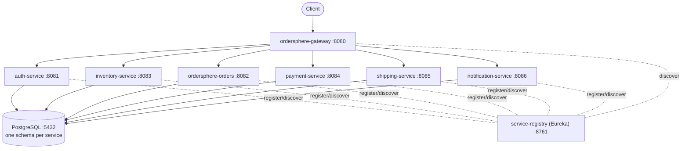
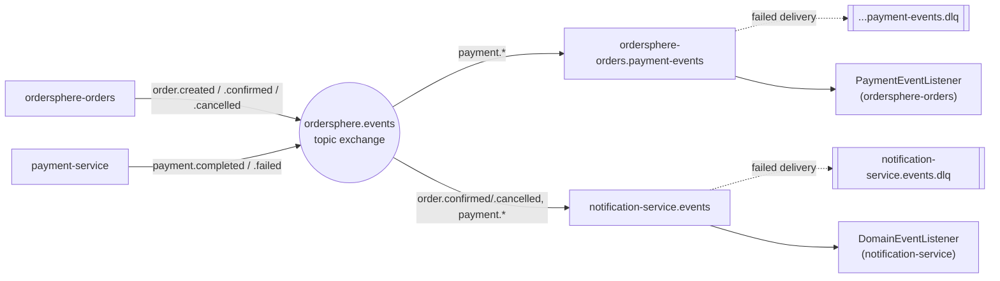

# OrderSphere — Technical Architecture

This document describes how OrderSphere is actually built today — architecture, service design, event messaging, data model, security, and the technology stack — verified against the codebase (Maven POMs, RabbitMQ config classes, service code, Flyway migrations) rather than restated from planning docs. See [product-functionality.md](./product-functionality.md) for the business-facing view.

**Version:** 1.0.0-SNAPSHOT | **Status:** Active development | **Verified against:** commit `fc6114f`

---

## 1. Overview

OrderSphere is a cloud-native order and inventory management platform built as ten independently deployable Spring Boot services. It exists to demonstrate — and exercise — the hard parts of distributed order processing: reserving stock without overselling, keeping payment and fulfillment eventually consistent, and giving every state transition a compensating path back out.

The system runs today as a full Docker Compose stack: a Eureka service registry, an API gateway, six business services, PostgreSQL (one schema per service), and RabbitMQ for asynchronous fan-out. Every service builds, has a Flyway-managed schema, and carries its own test suite.

---

## 2. Architecture

Two patterns coexist by design: synchronous orchestration for the order saga itself, and asynchronous fan-out for everything downstream of it.

### Orchestration, not pure choreography

The Orders service is the saga's orchestrator. When a customer places an order, `OrderService.createOrder` calls Inventory and Payment directly over load-balanced REST (Spring's `RestClient`, resolved through Eureka) and drives compensation inline — a failed reservation cancels the order immediately; a failed payment releases the reservation it just made. This is a deliberate departure from a fully event-choreographed design: REST gives the saga a synchronous, easy-to-reason-about failure path, while the event bus is reserved for everything that doesn't need to block the request.

### Events as the async layer

Every state change Orders makes is also published locally as a Spring `ApplicationEvent` and relayed onto a RabbitMQ topic exchange by a shared `DomainEventRelay`. Two things consume off that bus today: Notification service, which reacts to order and payment events to trigger customer messages, and Orders itself, which listens for `PaymentCompletedEvent`/`PaymentFailedEvent` as a low-latency shortcut around its own polling sweep job. Inventory, Payment, and Shipping are not yet wired as message consumers — they participate in the saga purely as REST call targets right now.

### Request topology

All external traffic enters through the gateway; every service resolves its peers (and is resolved by the gateway) via Eureka, and owns an isolated Postgres schema. Orders is the only service that calls the other three directly.

---

## 3. Service catalog

Nine runtime services plus two shared libraries. Ports match the Docker Compose configuration and are stable across local and containerized runs.

| Service | Port | Responsibility | Database |
|---|---|---|---|
| `ordersphere-gateway` | 8080 | Single external entry point; routes to services via Eureka discovery locator | — |
| `auth-service` | 8081 | Registration, login, JWT issuance, role assignment (admin-only) | `auth_db` |
| `ordersphere-orders` | 8082 | Order lifecycle and saga orchestration — calls inventory, payment, shipping | `orders_db` |
| `inventory-service` | 8083 | Product catalog, stock levels, reservation and release | `inventory_db` |
| `payment-service` | 8084 | Payment methods, async payment processing, refunds | `payment_db` |
| `shipping-service` | 8085 | Shipment creation, tracking-stage progression, returns | `shipping_db` |
| `notification-service` | 8086 | Multi-channel notification delivery, per-channel preferences, retry | `notification_db` |
| `service-registry` | 8761 | Eureka server — service discovery for every service above | — |
| `common-events` | — | Shared library: event POJOs, topic-exchange auto-configuration, routing-key derivation, dead-letter relay | — |
| `common-security` | — | Shared library: JWT issuance/validation, Spring Security filter, role model | — |

---

## 4. Event messaging

All async traffic moves through a single RabbitMQ topic exchange, `ordersphere.events`, declared once by `common-events`' auto-configuration and shared by every service on the classpath.

### Routing

Each of the 18 event types defined in `common-events` (`OrderCreatedEvent`, `PaymentCompletedEvent`, `ShipmentCreatedEvent`, and so on) is published under a routing key mechanically derived from its class name — `RoutingKeys.forEventType` turns `PaymentCompletedEvent` into `payment.completed`. A `DomainEventRelay` subscribes to every locally-published `BaseEvent` and forwards it to the exchange, so publishing a new event type never requires touching messaging wiring.

### Consumers

Two durable queues exist today, each with its own dead-letter exchange and queue for redelivery failures:

| Queue | Owner | Bound routing keys |
|---|---|---|
| `ordersphere-orders.payment-events` | `ordersphere-orders` | `payment.completed`, `payment.failed` |
| `notification-service.events` | `notification-service` | `order.confirmed`, `order.cancelled`, `payment.completed`, `payment.failed` |

Notification deliberately doesn't bind shipment events yet — `ShipmentCreatedEvent` and `DeliveryConfirmedEvent` carry no customer identity in the shipping schema to address a notification with, so that wiring is on hold until shipping-service tracks it.

Orders drives the saga synchronously (see §2) and publishes lifecycle events as a byproduct; only two consumers exist on the broker today, each with a dead-letter queue for redelivery failures.

> **Why both patterns exist:** REST orchestration keeps the order-placement request's success/failure path synchronous and easy to test. The event bus exists for consumers that shouldn't be on that critical path — notifications, and a faster-than-polling signal back to Orders. It is not (yet) the mechanism inventory or shipping use to react to order state.

---

## 5. Data & persistence

Database-per-service, no cross-service foreign keys. Every service ships its own Flyway migration history against a single PostgreSQL 16 instance (separate logical databases, seeded via `docker/postgres-init`).

| Service | Migrations |
|---|---|
| `auth-service` | `V1__create_users_table` |
| `ordersphere-orders` | `V1__create_orders_tables`, `V2__add_payment_and_shipment_tracking_to_orders` |
| `inventory-service` | `V1__create_inventory_tables` |
| `payment-service` | `V1__create_payment_tables` |
| `shipping-service` | `V1__create_shipping_tables` |
| `notification-service` | `V1__create_notification_tables` |

Orders' second migration is a small but telling design signal: rather than joining out to Inventory or Payment for status, Orders keeps its own denormalized `paymentId`/`shipmentId` tracking columns — consistent with treating those services as call targets, not sources of truth Orders queries live.

---

## 6. Security

Authentication is centralized in `auth-service`; enforcement is distributed via the shared `common-security` library.

- **JWT, 1-hour expiry** — `JwtProperties.expirationMillis` defaults to 3,600,000ms; tokens are signed with a secret injected via `JWT_SECRET` (falls back to a clearly-marked dev-only default in Compose).
- **Four roles** — `CUSTOMER`, `VENDOR`, `ADMIN`, `AUDITOR`, defined once in `auth-service`'s domain model and carried in the token's claims for downstream services to authorize against.
- **Password storage** — bcrypt via Spring Security's `PasswordEncoder`.
- **Service-to-service calls** — Orders' outbound REST calls to Inventory/Payment/Shipping forward the caller's bearer token; a `ServiceTokenProvider` issues a service-level token for calls the scheduled saga sweep makes without an inbound request context.

---

## 7. Technology stack

What every service is actually built on, confirmed against each module's `pom.xml`.

| Technology | Role |
|---|---|
| Java 17 | Language baseline, parent POM |
| Spring Boot 3.2.1 | Service framework across all nine modules |
| Spring Cloud Gateway | API gateway routing |
| Netflix Eureka | Service discovery, client + server |
| Spring Cloud LoadBalancer | Client-side balancing for Orders' outbound calls |
| Spring Data JPA | Persistence layer, every business service |
| PostgreSQL 16 | System of record, one schema per service |
| Flyway | Schema migrations |
| Spring AMQP / RabbitMQ 3.13 | Topic-exchange event fan-out |
| Spring Security | Auth filter chain, method-level authorization |
| jjwt | JWT issuance and validation |
| Jackson + jsr310 | Event (de)serialization, incl. `java.time` types |
| Lombok | Boilerplate reduction across domain/DTO classes |
| JUnit 5 + Testcontainers | Unit and integration tests against real Postgres/RabbitMQ |
| Docker + Docker Compose | Local multi-service environment, per-service Dockerfiles |
| Maven (multi-module) | Build & dependency management, shared parent POM |

> **Documented but not yet present in the tree:** Kubernetes manifests and Hyperledger Fabric are described in the project's architecture notes as target infrastructure. Neither has build artifacts in this repository yet — see §10.

---

## 8. Build & deployment

The working deployment path today is Docker Compose; Kubernetes is documented as the target but has no manifests in-repo yet.

- `mvn clean package` builds all ten modules from the root parent POM.
- Each of the eight runtime services has its own `Dockerfile`; `docker-compose.yml` builds and wires all eight plus `postgres` and `rabbitmq`, in dependency order (registry and brokers first, business services depend on both).
- Configuration is environment-variable driven throughout — `DB_HOST`, `EUREKA_URI`, `RABBITMQ_HOST`, `JWT_SECRET` — the same images run locally or in a cluster without rebuilding.
- A single service can be run standalone with `mvn spring-boot:run` provided Postgres and Eureka are reachable.

---

## 9. Testing

Every module carries its own test suite; `common-events` is the most heavily covered, with one test class per event type plus the routing/relay logic.

| Module | Test classes |
|---|---|
| `common-events` | 22 |
| `ordersphere-orders` | 9 |
| `notification-service` | 6 |
| `inventory-service` | 5 |
| `payment-service` | 5 |
| `shipping-service` | 4 |
| `auth-service` | 3 |
| `common-security` | 2 |
| `ordersphere-gateway` | 1 |
| `service-registry` | 1 |

Integration coverage runs against real dependencies via Testcontainers (Postgres and RabbitMQ), rather than mocking the database or broker — the suites in `ordersphere-orders` and `common-events` in particular exercise actual message publish/consume round-trips.

---

## 10. Roadmap

What's shipped versus what's still ahead, per the project's own tracked roadmap.

- [x] Message broker (RabbitMQ) wired for cross-service async events
- [ ] React/Vue.js web UI
- [ ] Comprehensive API documentation (OpenAPI/Swagger)
- [ ] Hyperledger Fabric ledger service for immutable audit trails
- [ ] CQRS-based analytics/reporting
- [ ] Distributed tracing (Jaeger/Zipkin)
- [ ] Circuit breakers (Resilience4j) around Orders' outbound REST calls
- [ ] Centralized logging (ELK stack)
- [ ] Caching layer (Redis)
- [ ] OAuth2/OIDC, Kubernetes manifests
